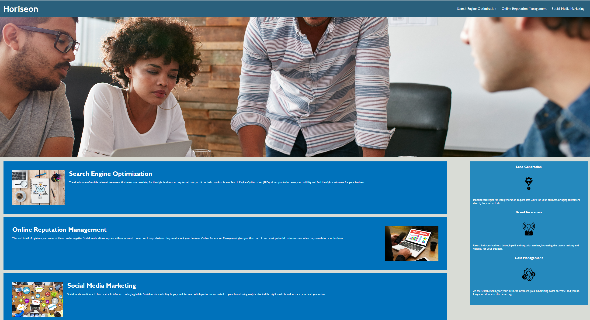

# week1challenge

## Description

I am practicing what I learned in the first week of the bootcamp.
I have improved the code for this webpage and made sure it was accessible.
I learned how all the elements interact together.

## Usage

Provide instructions and examples for use. Include screenshots as needed.

To add a screenshot, create an `assets/images` folder in your repository and upload your screenshot to it. Then, using the relative filepath, add it to your README using the following syntax:

    ```md
    
    ```

## License

MIT license

---
